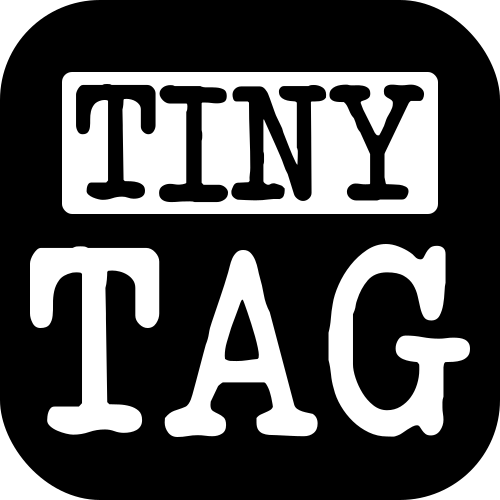
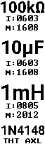

# TinyTag - create labels for a very specific need

> [!IMPORTANT]
> This is a custom tool for a very specific use-case that is primarily intended to be used by me. Feel free to use and adapt it to your needs, but don't expect any support for it.

## ⚡ Quick Start

1. Edit `src/main.py` to reflect the component labels that you need
2. Run `uv run src/main.py` from your terminal
3. Copy the generated label from `data/label.png` to your phone
4. Load the label image as an image into the Print&Design 2 app and rotate it 90°
5. Print as one single label and cut into smaller pieces

> [!NOTE]
> This guide assumes that you are using a ["Brother P-Touch Cube" (PT-P300BT)](https://store.brother.co.uk/devices/label-printer/p-touch/pt/ptouchcube) with a 12mm tape and the accompanying ["Design&Print 2" app](https://play.google.com/store/apps/details?id=com.brother.ptouch.designandprint2)

## 🤨 What does this do?

This is a tool for the very specific use-case of printing multiple tiny labels on my P-Touch Cube label printer in a vertical orientation, avoiding the limitations of the app, which are:

- cannot print in rotated orientation (characters will be stacked vertically instead of side-by-side)
- a maximum of 5 text fields
- limited fonts

TinyTag does not print the label itself, it merely creates an image that perfectly fits the resolution of the printer (to avoid scaling artifacts) which can then be printed by the respective app.

&nbsp;

In the case of the P-Touch Cube, the "horizontal" resolution is 64px (180dpi on 9mm print width) and the "vertical" resolution is unlimited (180dp on unlimited length) when looking at the label with the printed text upright.

## ⚙️ Custom configs

If your printer has different requirements, you can create a custom config in the `src/configs.py` file and pass an instance of the new config to the `generate_label(..., config=YourCustomConfig())` method. You can also change the default config in `src/drawer.py`, then you won't have to pass it manually.

Make sure that `YourCustomConfig` inherits from the base `DrawConfig` class and implements all of its methods/properties.
Feel free to take some inspiration from the other config(s).

## 🏷️ Custom components/values/...

If you need to label custom components that are not covered by my predefined components, feel free to add/change anything in `src/values.py`. When creating a new component type, make sure you inherit from the base `Component` class and implement all of its methods/properties.

## 📜 Further resources about my setup

- [uv](https://astral.sh/uv)
- [Pillow](https://pypi.org/project/pillow/)
- [Design&Print 2 (Android)](https://play.google.com/store/apps/details?id=com.brother.ptouch.designandprint2)
- [P-Touch Cube Power Adapter](https://www.thingiverse.com/thing:6910533)
- Fonts: [Greenscreen](https://www.dafont.com/green-screen.font), [PressStart2P](https://www.dafont.com/press-start-2p.font), [Roboto](https://www.dafont.com/roboto.font)

### Other (potentially relevant) resources I found but did not use:

- Design&Print 2 [(iOS)](https://apps.apple.com/en/app/brother-p-touch-design-print-2/id1468451451) [(Brother EN)](https://www.brother.co.uk/support/ptouchcube/downloads) [(Brother DE)](https://www.brother.de/etiketten-und-belegdrucker/cube/p-touch-design-print-app)
- [PT-P300BT python "driver"](https://github.com/Ircama/PT-P300BT)
- [Qt5 app for the PT-P300BT (PyTouch Cube)](https://github.com/piksel/pytouch-cube)
